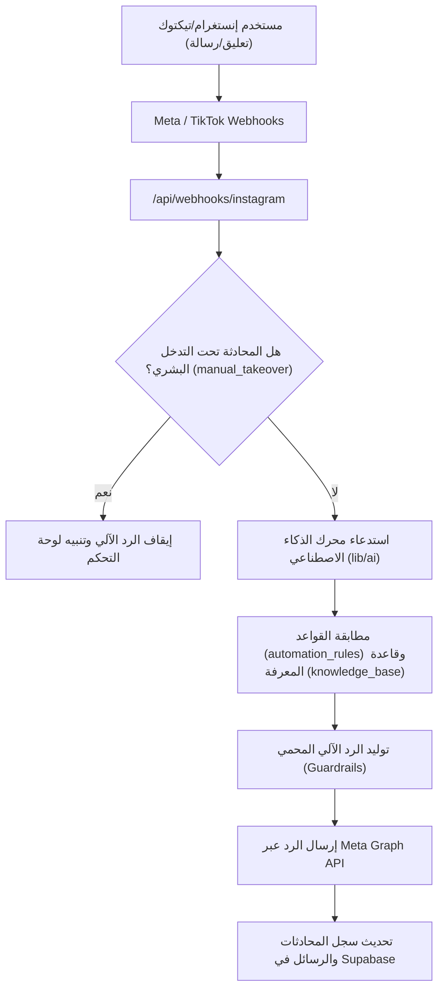

# 🏗️ توثيق هيكل وأقسام التطبيق - App Structure Documentation

تطبيق **SonsBot 2 (Ghent Cafe AI Support)** هو منصة إدارة ردود ذكاء اصطناعي ودعم عملاء متعددة المستأجرين (Multi-Tenant AI Support Platform) متخصصة في استقبال والرد الآلي على تعليقات ورسائل **Instagram** و **TikTok**، إدارة القوائم، الأسئلة الشائعة (FAQs)، وتحويل المحادثات للدعم البشري (Manual Agent Takeover).

---

## 🛠️ 1. التقنيات الأساسية (Tech Stack)

* **الإطار البرمجي (Framework):** [Next.js 14](https://nextjs.org) (App Router - TypeScript)
* **المكتبات الرسومية (UI & Styling):** React 18, Lucide React (Icons), Vanilla CSS System (`app/globals.css`)
* **قاعدة البيانات والتحقق (Database & Auth):** [Supabase](https://supabase.com) (`@supabase/supabase-js`, `@supabase/ssr` مع نُهج حماية Row Level Security)
* **محرك الذكاء الاصطناعي (AI Engines):** OpenAI API (GPT-4o/GPT-3.5) / Google Gemini API مع نظام Guardrails
* **إدارة المنصات الخارجية (Integrations):** Meta Graph API (Instagram Direct Messages & Comments API), TikTok Business API
* **التشفير والحماية (Security):** AES-256 Token Encryption, Webhook Signature Verification, CSRF OAuth States

---

## 📂 2. هيكل المجلدات الرئيسي (Directory Structure)

```
sonsbot2/
├── app/                        # Next.js App Router (الصفحات والموجهات)
│   ├── api/                    # API Endpoints (الخلفية والموصلات)
│   │   ├── admin/              # إدارة المستأجرين والأعضاء
│   │   ├── auth/               # مسارات تسجيل الدخول عبر Instagram OAuth
│   │   ├── comments/           # معالجة وجلب التعليقات
│   │   ├── conversations/      # إدارة المحادثات والـ Direct Messages
│   │   ├── cron/               # مهام التشغيل الدوري (Cleanups, Synced Tasks)
│   │   ├── faqs/               # إدارة الأسئلة الشائعة
│   │   ├── knowledge/          # إدارة قاعدة المعرفة للذكاء الاصطناعي
│   │   ├── menu/               # إدارة قائمة المأكولات والمشروبات
│   │   ├── messages/           # إرسال واستقبال الرسائل
│   │   ├── rules/              # قواعد الأتمتة والردود التلقائية
│   │   └── webhooks/           # استقبال تفرعات Webhooks من Instagram و TikTok
│   ├── dashboard/              # لوحة التحكم الرئيسية (Client / Admin Panel)
│   │   ├── automation/         # ضبط قواعد الأتمتة والرد الآلي
│   │   ├── comments/           # واجهة مراجعة تعليقات المنشورات
│   │   ├── conversations/      # واجهة المحادثات المباشرة والتحويل البشري
│   │   ├── knowledge/          # واجهة تغذية الذكاء الاصطناعي والمعلومات
│   │   ├── menu/               # واجهة إدارة المنيو والأسعار
│   │   ├── settings/           # إعدادات الحساب وربط القنوات
│   │   └── layout.tsx          # التخطيط العام للوحة التحكم (Sidebar & Header)
│   ├── login/                  # صفحة تسجيل الدخول
│   ├── privacy/                # سياسة الخصوصية والشروط
│   ├── globals.css             # التصميم العام وأنماط Glassmorphic والداكن
│   ├── layout.tsx              # التخطيط الجذر للتطبيق
│   └── page.tsx                # الصفحة الرئيسية (Landing / Redirect)
├── components/                 # المكونات الرسومية التفاعلية
│   ├── LanguageSwitcher.tsx    # بدّال اللغة (العربية / الإنجليزية)
│   ├── Sidebar.tsx             # شريط التنقل الجانبي للوحة التحكم
│   └── ui/                     # العناصر الرسومية المتبعة
├── lib/                        # المنطق البرمجي الأساسي (Business Logic)
│   ├── ai/                     # برمجيات الذكاء الاصطناعي، التوجيه، والـ Guardrails
│   ├── auth/                   # برمجيات التحقق من الجلسات والصلاحيات
│   ├── config.ts               # فحص والتحقق من متغيرات البيئة (Environment Config)
│   ├── connectors/             # الموصلات الخارجية (Instagram Connectors, TikTok API)
│   ├── db/                     # عملاء قاعدة البيانات (Supabase Client, SSR Client)
│   ├── i18n/                   # الترجمة والدعم متعدد اللغات
│   └── security/               # تشفير الـ Tokens (AES-256) والتحقق من التوقيعات
├── locales/                    # ملفات قاموس الترجمات (`ar.json`, `en.json`)
├── supabase/
│   └── migrations/             # مخططات وتحديثات قاعدة البيانات (SQL Migrations & RLS)
├── tests/                      # الاختبارات المؤتمتة (Vitest & Integration Tests)
├── middleware.ts               # الوسيط البرمجي لتمرير الجلسات وحماية الصفحات
└── .env.hostinger.clean        # ملف متغيرات البيئة النظيف المجهز للاستضافة
```

---

## 🗄️ 3. مخطط قاعدة البيانات والأمان (Database Schema & RLS)

التطبيق يعتمد على نظام **Multi-Tenant** حيث ينتمي كل مستخدم أو مطعم لـ `tenant`:

| الجدول (Table) | الوصف والدور |
| :--- | :--- |
| `tenants` | بيانات المستأجر/المطعم (الاسم، اللغويات، حالة الاشتراك). |
| `tenant_members` | ربط المستخدمين (`auth.users`) بالمستأجر وتحديد الأدوار (`owner`, `admin`, `agent`). |
| `platform_connections` | تخزين الـ Access Tokens المشفرة لحسابات انستغرام وتيكتوك المرتبطة. |
| `conversations` | سجل المحادثات الثنائية (DMs)، وتتضمن خاصية `is_manual_takeover` للتوقف الآلي عند تدخل العنصر البشري. |
| `messages` | تفاصيل الرسائل المتبادلة (المُرسل، النص، الطابع الزمني، الحالة). |
| `automation_rules` | قواعد الأتمتة (الكلمات المفتاحية، الردود المباشرة، والـ Fallback DM). |
| `faqs` & `knowledge_base` | بيانات الوجبات، الأسعار، ساعات العمل، والأسئلة الشائعة المستخدمة في الـ RAG. |
| `oauth_states` | التحقق من صحة طلبات تسجيل الدخول عبر Instagram OAuth لمنع هجمات CSRF. |

> **🔐 سياسات الأمان (Row Level Security - RLS):**
> تضمن جميع الجداول عدم قدرة أي مستأجر على الوصول لبيانات مستأجر آخر بفضل سياسات `auth_bound_rls` و `fix_platform_connections_rls`.

---

## ⚙️ 4. أهم الدورات وسير العمليات (Core Application Flows)



---

## 🔑 5. إعدادات البيئة والاستضافة (Hostinger & Env Audit)

تم تهيئة وتنظيف ملف متغيرات البيئة المتوافق مع استضافة Hostinger (`.env.hostinger.clean`):

| المتغير (Variable) | الوظيفية والهدف |
| :--- | :--- |
| `NEXT_PUBLIC_APP_URL` | رابط التطبيق العام على الاستضافة (`https://elsons.site`) |
| `NEXT_PUBLIC_SUPABASE_URL` | رابط مشروع Supabase |
| `NEXT_PUBLIC_SUPABASE_ANON_KEY` | المفتاح العام للاستعلامات من المتصفح (تم تصحيحه وإزالة الرموز غير القياسية) |
| `SUPABASE_SERVICE_ROLE_KEY` | المفتاح الفائق للاستعلامات الإدارية بالسيرفر |
| `TOKEN_ENCRYPTION_KEY` | مفتاح تشفير وفك تشفير الـ Access Tokens (AES-256) |
| `INSTAGRAM_APP_ID` | معرف تطبيق Meta / Instagram |
| `INSTAGRAM_APP_SECRET` | المفتاح السرّي لتطبيق Meta |

---

## 📑 6. أهم الإنجازات والتحسينات المنجزة مؤخراً (Recent Progress Summary)

1. **إصلاح جلسات التحقق (Supabase Auth SSR Middleware):**
   * تحديث `middleware.ts` وتطوير `createMiddlewareSupabaseClient` لضمان تجديد الـ Cookies ومنع انقطاع جلسة المستخدم أثناء التنقل.
2. **إسناد الصلاحيات وفصل المستأجرين (Multi-tenant RLS Fixes):**
   * كتابة معالجات SQL خالية من التعارض في `platform_connections` لمنع أخطاء الـ RLS عند ربط القنوات.
3. **ميزة التحويل البشري (Manual Agent Takeover):**
   * إضافة حقل `is_manual_takeover` وحصل المندوب على إمكانية إيقاف بوت الذكاء الاصطناعي فوراً واستكمال المحادثة يدوياً.
4. **تضمين الردود الاحتياطية (Fallback DMs):**
   * إضافة إمكانية تحديد رسالة خاصة تلقائية تُرسل للعميل عند التعليق بكلام يتطلب متابعة خاصة.
5. **فحص وتنظيف بيئة Hostinger (.env Audit & Encoding Fix):**
   * اكتشاف ومعالجة مشكلة حرف غير قياسي (Arabic Character `س`) في مفتاح `NEXT_PUBLIC_SUPABASE_ANON_KEY` الذي كان يسبب خطأ `non ISO-8859-1 code point` في المتصفح.
   * إعداد ملف `.env.hostinger.clean` محمي وجاهز للنشر المباشر.
